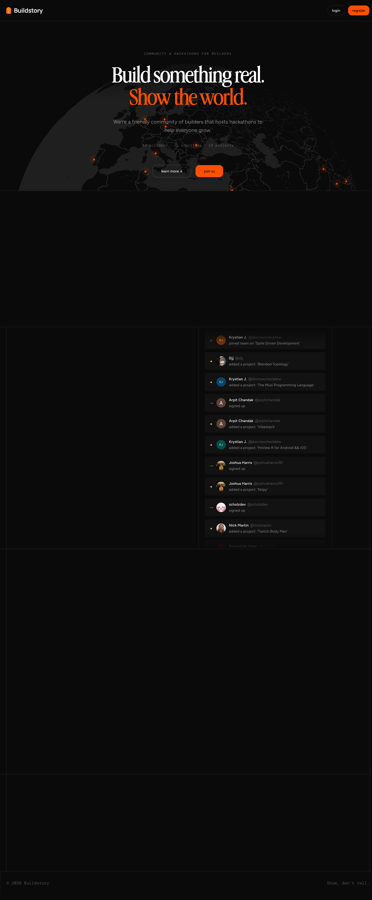

# Buildstory: Show, Don't Tell (If You Can See It)

**Submitted by:** Charlie Coppinger (yes, he asked for this)
**The site:** buildstory.com
**Score: 72/100 - Grade C**

## First impressions

Clean. Confident. Black and orange without being garish. The globe with scattered builder dots communicates global reach better than any copy could. The serif headline with the orange second line looks like a real product, not a Framer template someone never finished.

The tagline is "Show, don't tell." Good one. Then you try to see what people actually built and you hit a login screen.

## The irony problem

The hero says: "Build something real. Show the world."

/projects requires login. /builders requires login. The activity feed on the homepage teases names and project titles, but clicking anything walls you off until you register. "Show the world" should mean the world can see it. Without an account.

This is the biggest problem on the site. Not a bug, not a missing tag. A product decision that contradicts the core promise. You're asking people to trust a visibility platform that won't show them anything until they sign up.

Public project pages fix this. Every project becomes a link. Every link is a discovery path. Right now everything is locked behind a form.

## SEO

Lighthouse: 100/100. Meta description, Open Graph, Twitter card, viewport, robots — all in place. OG image is set. Every image has alt text. For a community side project, that's more thorough than most.

The gap: the title tag is "Buildstory." Twelve characters. Google wants 30-60. "Buildstory — Community & Hackathons for Builders" fills the slot. There's also no canonical URL. Both www.buildstory.com and buildstory.com resolve, and Google has to guess which one counts. Pick one and declare it.

Word count is 666. No issues.

## Accessibility

93/100. Two failures worth addressing:

**No `<main>` landmark.** Everything lives in `
` wrappers. Screen readers navigate by landmarks. Without `<main>`, keyboard and screen reader users have no clear entry point. One tag fixes it.

**Footer contrast fails.** "© 2026 Buildstory" and "Show, don't tell." use `text-neutral-600` (#525252) on a near-black background (#0a0a0a). Contrast ratio: 2.53:1. WCAG AA requires 4.5:1. Change to `text-neutral-400`. Nobody reads footer text anyway, so this is a quick win with zero visual impact.

Clerk's image proxy throws cross-origin cookie warnings in DevTools. Not urgent.

## What works

- SEO: 100/100
- Best Practices: 96/100
- OG and Twitter cards configured correctly
- Every image has alt text
- Clean, memorable visual identity
- Globe works as actual social proof, not just decoration
- Activity feed shows real people, real projects
- 666 words of homepage content

## Fixes

1. **Make projects and builder profiles publicly viewable.** The only fix that actually matters for the product.
2. **Add `<main>` around the primary content.** One tag.
3. **Lighten the footer text.** `text-neutral-400` or lighter.
4. **Expand the title tag.** 50-60 characters with a descriptor.
5. **Declare a canonical URL.** www or apex, pick one.

Title and canonical: ten minutes. The `<main>`: five. Footer contrast: two. Public profiles: longer, it's a real feature decision. Everything else is an afternoon.

## Verdict

72/100. The technical issues are all fixable in an afternoon. 44 builders, 21 countries, 18 projects — there's real activity here, and the visual identity holds up.

The product issue is harder. A platform built to show work to the world should let the world see it. Right now every project is effectively private. Fix that, and the homepage stops making a promise it doesn't keep.

**Overall Score: 72/100 - Grade C**
